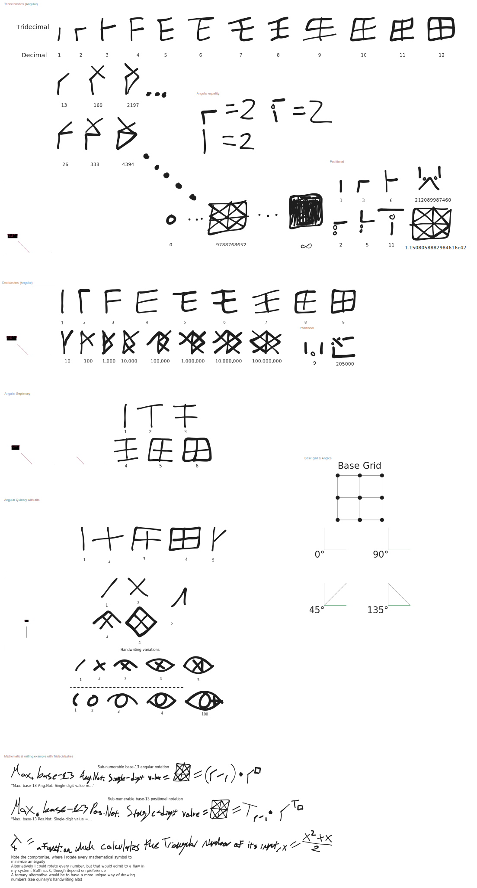

# Tridecidashes Text Explanation

Tridecidashes (technically, n-dashes) are a versatile system for numeral systems which utilize dashes, angles & the counts or positions of these. 
It seeks to be able to represent values just as they are used today, simply in a more regular fashion. This means representing numbers $`-\infty\le\infty^{-1}\le\infty`$ with a minimal amount of symbols
No arbitrary conventions where a broader system could be used.
	Such as in Roman Numerals, disputing whether the "correct" form for $`8_\text{dec}`$ is VIII or IIX, caused
by the facts that: 
1.	It is unclear whether the goal is to minimize symbols & subtract from the greatest possible number, or build from the least possible number until a simpler solution presents itself
	-	Technically, there are no rules.
	-	In Tridecidashes, simple consistency & consistent simplicity are preferred.
2.	An unnecessary universal convention is even being attempted, & should be left to private systems for their convenience
	-	IIX is useful for its compactness & fewer strokes required, but ordinally VIII is clearer
Tridecidashes combine mathematical efficiency with reasonable legibility.
This document covers everything that should be necessary. Numeral systems must have an angular or positional option. Sub-numeralization is completely optional.
## Numerals

All systems must use an anchor, which declares a numeral & equals one
Systems must define an alignment pattern for these subnumerals
Alignment patterns for angular numeral systems need only a grid.
Alignment patterns for positional systems need positions for every dash, with an index, which is plugged into a formula.
>	Ya can't just make it a buncha' random values.

The patterns for a positional system must follow the same patterns as the angular based system.
### Sub-Numeralization

>	Imported from Roman numerals

In obeying systems, numerals will be combined in order of value to sum their values, creating a normal number
However, a numeral placed before another numeral of greater value will subtract its value from the following numeral, carrying the difference into the number sum.
>	You can't place numerals together, anyways, so might as well give it a use
>	>	Each sub-numeral is technically just a place, and you can't create every number with them.
>	>	Using a multiplication sign is necessary
## Dashes & Angles

Lines at relative angles of 0° , 45° , 90° & 135°  are "dashes" and can be drawn spanning segments of a $`3^2`$ grid.
>	Grid size was chosen to accommodate tridecimal. It is arbitrary.
>	The amount of dashes allowed to be assigned in a grid may be restricted, and any writing outside of this restricted grid will still be considered distinct.
>	Grids can be translated, transformed, & rotated, however dashes cannot.

There are two levels of value, as in normal positional systems: digit & place.
Digit values are represented by a set of angles or positions, and place values are represented by another set. Digit & place value are multiplied to find the numeral value. The amount of digit values & place values are 13 & 8 by default. Base is solely the base of the place value exponent.
-	In "angular" notation every angle may be assigned a unique value in a numeral. A dash placed anywhere in a numeral will have the effect of its angle.
	-	Maximum values are very moderate
		-	The maximum digit value in this system would be $`b-1`$, where $`b`$ equals the radix.
		-	The maximum place value would be $`b^n`$, where $n$ equals the maximum index
		-	Thus, the maximum value is $`(b-1)\cdot b^n`$
	-	Only the angle of the dash matters, and it is only combined with the count of other dashes to find the numeral value
		-	Orders should only be assigned for legibility.
-	In "positional" notation there are formulaically determined positions where occupying dashes will affect the numeral value according to the value of their position.
	-	Maximum values can grow much higher
		-	The maximum digit value in this system would be $`\frac{(b-1)^2+(b-1)}{2} = T_{b-1}`$, where $`T`$ is a function which calculates triangular numbers of input.
		-	The maximum place value would be $`b^{T_n}`$
		-	Thus, the maximum numeral value is $`T_b\cdot b^{T_n}`$

>	[!TIP]
>	It is suggested to also review the visual diagram, which includes examples of bases & handwriting alternatives. 
>	Scene data is embedded for fellow Excalidrawers.

Questions?
Email me at <a href="mailto:learn2read@school.com?subject=Help%20me%20learn%20to%20read!&body=Hello%2C%20I%20am%20illiterate%20%26%20cannot%20read%20common%20language%2C%20please%20teach%20me%20how%20to%20read!">learn2read@school.com</a>
